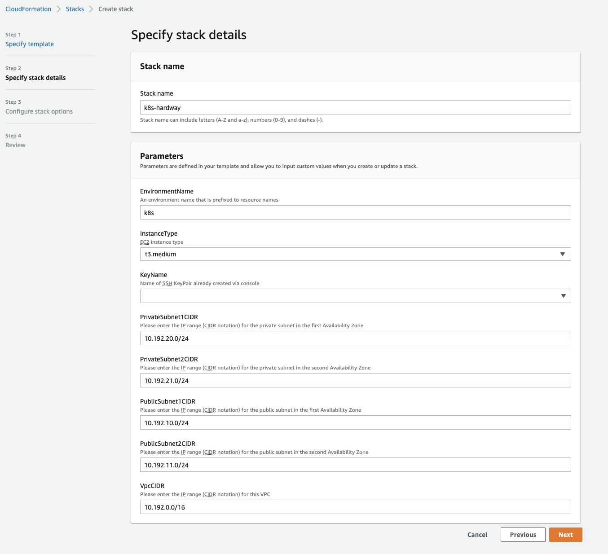
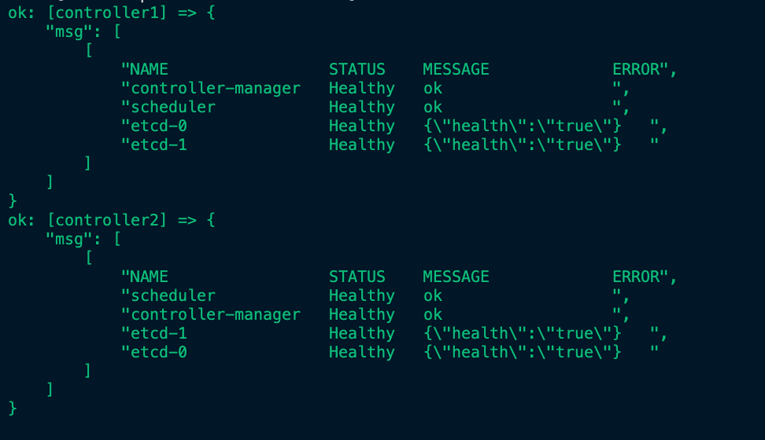

# kubernetes-the-hard-way-on-aws
**Setup Kubernetes the hard way on AWS**

*This is intended for audience that wants to understand how Kubernetes all fits together in AWS before going to production.* 

*In this tutorial, we deployed the infrastructure as code on AWS using AWS CloudFormation. We configured all the needed packages using Ansible for Configuration as Code.*

# Pre-requisites:
- [AWS CLI](https://docs.aws.amazon.com/cli/latest/userguide/getting-started-install.html) 
- [AWS Account](https://aws.amazon.com/premiumsupport/knowledge-center/create-and-activate-aws-account/)

# Cluster Details
- kubernetes v1.21.0
- containerd v1.4.4
- coredns v1.8.3
- cni v0.9.1
- etcd v3.4.15
- weavenetwork 
# Usage Instructions

## Deploying the Infrastructure with CloudFormation

- Goto AWS Console > Choose Region (e.g. eu-west-1) > CloudFormation > Create Stack
- Use the CF Yaml template in *infrastructure/k8s_aws_instances.yml*
- See image below:

 

## Setting up for deployments
- Get instances and create Ansible inventory on your ansible controller server

> `aws ec2 describe-instances --filters "Name=tag:project,Values=k8s-hardway" --query 'Reservations[*].Instances[*].[PrivateIpAddress, [Tags[?Key==`Name`].Value] [0][0]]' --output text`

- Transfer deployments/playbooks to ansible server

>`scp -i ~/.ssh/key.pem *.yml *.yaml inventory ubuntu@<ansible-server>:~`

- After building the inventory file, test if all hosts are reachable

> list all hosts to confirm
> 
> `ansible all --list-hosts -i inventory`

## Configuring the Servers with Ansible
**From the Ansible server, execute the Ansible playbook in the following order**

1. `ansible-playbook -i inventory -v client_tools.yml`
2. `ansible-playbook -i inventory -v cert_vars.yml`
3. `cat variables.text >> env.yaml`
4. `ansible-playbook -i inventory -v create_ca_certs.yml`
5. `ansible-playbook -i inventory -v create_kubeconfigs.yml`
6. `ansible-playbook -i inventory -v distribute_k8s_files.yml`
7. `ansible-playbook -i inventory -v deploy_etcd_cluster.yml`
8. `ansible-playbook -i inventory -v deploy_api-server.yml` See results below.
9. `ansible-playbook -i inventory -v rbac_authorization.yml`
10. `ansible-playbook -i inventory -v deploy_nginx.yml`
11. `ansible-playbook -i inventory -v workernodes.yml`
12. `ansible-playbook -i inventory -v kubectl_remote.yml`
13. `ansible-playbook -i inventory -v deploy_weavenet.yml`
14. [Setup core DNS](./coreDNS.md)
15. `ansible-playbook -i inventory -v smoke_test.yml`

Results:

# Clean Up

*Delete the AWS CloudFormation Stack*

>`aws cloudformation delete-stack --stack-name k8s-hardway`

*Check if the AWS CloudFormation Stack still exist to confirm deletion* 

>`aws cloudformation list-stacks --stack-status-filter CREATE_COMPLETE --region eu-west-1 --query 'StackSummaries[*].{Name:StackName,Date:CreationTime,Status:StackStatus}' --output text | grep k8s-hardway`